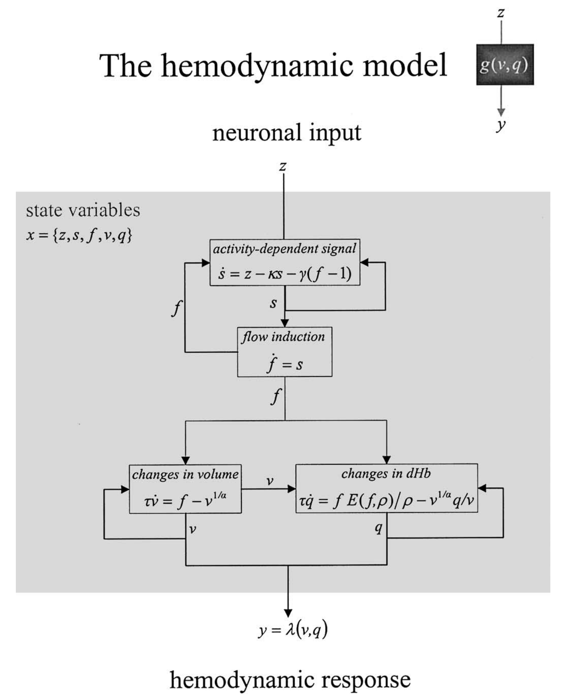

# rsHRF (Resting State HRF Estimation and Deconvolution)

## HemodynamicResponseModeling

(From: Takuya Ito's https://github.com/ito-takuya/HemodynamicResponseModeling
modeling hemodynamic response functions of the BOLD signal using Windkessel-Balloon model)

Based on Friston KJ, Harrison L, Penny W. Dynamic causal modelling. Neuroimage 2003;19:1273–1302.


### Hemodynamic state equations

The remaining state variables of each region are biophysical states engendering the BOLD signal and mediate the
translation of neuronal activity into hemodynamic responses. Hemodynamic states are a function of, and only of,
the neuronal state of each region. These equations have been described elsewhere (Friston et al., 2000) and constitute a
hemodynamic model that embeds the _Balloon–Windkessel model_ (Buxton et al., 1998; Mandeville et al., 1999).




#### Takuya Ito implementation of Friston KJ et al. Dynamic causal modelling. Neuroimage 2003;19:1273-1302.
```
def balloonWindkessel(z, sampling_rate, alpha=0.32, kappa=0.65, gamma=0.41, tau=0.98, rho=0.34, V0=0.02):
    """
    Computes the Balloon-Windkessel transformed BOLD signal
    Numerical method (for integration): Runge-Kutta 2nd order method (RK2)

    z:          Measure of neuronal activity (space x time 2d array, or 1d time array)
    sampling_rate: sampling rate, or time step (in seconds)
    alpha:      Grubb's exponent
    kappa:      Rate of signal decay (in seconds)
    gamma:      Rate of flow-dependent estimation (in seconds)
    tau:        Hemodynamic transit time (in seconds)
    rho:        Resting oxygen extraction fraction
    V0:         resting blood vlume fraction

    RETURNS:
    BOLD:       The transformed BOLD signal (from neural/synaptic activity)
    s:          Vasodilatory signal
    f:          blood inflow
    v:          blood volume
    q:          deoxyhemoglobin content
    """
```


## Nilearn: Example of hemodynamic response functions.

The HRF is the filter that couples neural responses to the metabolic-related changes in the MRI signal. HRF models are simply phenomenological.
- https://nilearn.github.io/auto_examples/04_glm_first_level/plot_hrf.html


## rsHRF: A toolbox for resting-state HRF estimation and deconvolution

- Guo-Rong Wu, Nigel Colenbier, Sofie Van Den Bossche, Kenzo Clauw, Amogh Johri, Madhur Tandon, Daniele Marinazzo. “rsHRF: A Toolbox for Resting-State HRF Estimation and Deconvolution.” Neuroimage, 2021, 244: 118591. [[link](https://www.sciencedirect.com/science/article/pii/S1053811921008648)]

- **Demo data** at: https://www.nitrc.org/frs/?group_id=1304#   (sub-10171_func_sub-10171_task-rest_bold.json /  rsHRF_demo_UCLA_results.zip) from UCLA Consortium for Neuropsychiatric Phenomics LA5c Study - https://www.openfmri.org/dataset/ds000030. See also https://www.openfmri.org/dataset-orientation-issues

- http://bids-apps.neuroimaging.io/rsHRF
>Resting state HRF estimation from BOLD-fMRI signal. This toolbox is aimed to retrieve the onsets of pseudo-events triggering an hemodynamic response from resting state fMRI BOLD voxel-wise signal. It is based on [point process](https://en.wikipedia.org/wiki/Point_process) theory, and fits a model to retrieve the optimal lag between the events and the HRF onset, as well as the HRF shape, using either the canonical shape with two derivatives, or a (smoothed) Finite Impulse Response.
>
>Once that the HRF has been retrieved for each voxel, it can be deconvolved from the time series (for example to improve lag-based connectivity estimates), or one can map the shape parameters everywhere in the brain (including white matter), and use the shape as a pathophysiological indicator.


The input is voxelwise BOLD signal, already preprocessed according to your favorite recipe. Important thing are:

- bandpass filter in the 0.01-0.08 Hz interval (or something like that)
- z-score the voxel BOLD time series
 
**To be on the safe side, these steps are performed again in the code**.

The input can be images (3D or 4D), or directly matrices of [observation x voxels].

It is possible to use a temporal mask to exclude some time points (for example after scrubbing).

The demos allow you to run the analyses on several formats of input data.

### rsHRF Installation and Setup
This App can be used as a standalone Python Package OR as a BIDS-App through Docker.

### Standalone Python Package (Command Line Interface)
To be used as a command line tool, ensure that you have Python>=3.6 and use the command pip3 install rsHRF. This command takes care of all the necessary dependencies so that the tool is usable straight out of the box. Once done, run rsHRF --help to see the required positional and optional arguments. The command line for the app installed in this way is rsHRF.

**We will install and use `rsHRF` in the [`SageMath`](https://www.sagemath.org) `9.5` environment:**
```
conda deactivate                                             # no conda environments (even not "base")
sage --pip install rsHRF                                     # install the rsHRF toolbox in sage
sage --pip install nilearn                                   # install the Nilearn package in sage
sage --pip install mat4py                                    # load & save data in Matlab format in sage
sage --pip install git+https://github.com/ANTsX/ANTsPy.git   # install ANTsPy package in sage (long time)

sage -n                                          # start a Jupyter Notebook (with the SageMath 9.5 kernel)
```

### Usage

http://bids-apps.neuroimaging.io/rsHRF/

#### The input:

There are 3 ways one can input data to this application.

- A standalone .nii / .nii.gz or .gii / .gii.gz file. This option can be accessed using the --input_file optional argument followed by the path of the file.

- A standalone .txt file. This option can be accessed using the --ts optional argument followed by the path of the file.

- A BIDS formatted data-set directory. This option can be accessed using the --bids_dir optional argument followed by the path of the directory. This requires the input dataset to be in valid BIDS format, and have a derivatives type with preprocessed resting-state fMRI data. We highly recommend that you validate your dataset with the free, online BIDS Validator.

Out of the above 3 options, one of them is always required and more than one cannot be supplied at once.

#### The mask / atlas files:

Mask files are only provided along with the --input_file or bids_dir argument. There are 2 ways one can supply the corresponding mask / atlas files.

- A standalone .nii / .nii.gz or .gii / .gii.gz file. This option can be accessed using the --atlas optional argument followed by the name of the file.

- The --brainmask argument which tells the application that the mask files are present within the BIDS formatted data-set directory itself (which was supplied with --bids_dir).

Out of the above 2 options, both cannot be supplied at once. In the case where neither of the 2 options are supplied, the app proceeds to generate a mask by computing the variance, however, providing a mask-file is strongly recommended.

Also, --input_file and --brainmask together are an invalid combination.

The 5 use-cases are explained below:

- --input_file : The standalone .nii / .nii.gz or .gii / .gii.gz file is passed to the application for the analysis, the mask gets generated by computing the variance, and the outputs are determined accordingly.

- --ts : The standalone .txt file containing a time-series (floating point values separated by line breaks), or multiple time-series’ (, separated floating point values, where one time-series corresponds to a column). No mask file is required in this scenario, and the outputs are determined accordingly.

- --input_file and --atlas : The standalone atlas and the standalone input_file are passed to the application for the analysis and the outputs are determined accordingly.

- --bids_dir and --atlas : The standalone atlas is used with ALL the input files present in the bids_dir directory. Thus, the atlas serves as a common mask for the whole BIDS formatted data-set.

- --bids_dir and --brainmask : This should be used when for each input file present in the BIDS formatted data-set, the corresponding mask file exists within the same data-set. The application then pairs the input_files with their corresponding masks provided that the 2 files share a common prefix.


#### The output directory:

The output directory is accessed using --output_dir, and is the folder under which all the resulting .nii / .gii / .mat / .png files will be stored. The application further makes folders for each of the participants / subjects if the input is supplied through the argument --bids_dir. In the case of --ts argument, all the output types are stored in the .mat file. It is mandatory to provide an output directory.


#### The Analysis Level:

There are 2 kinds of analysis that can be performed. This can be accessed using --analysis_level.

- participant : participant level analysis performs the analysis for each (or some) subject(s) present in the BIDS formatted data-set. This is mandatory when the input is supplied with --bids_dir as group level analysis is not supported yet. This should not be supplied when input is supplied with --input_file argument. Doing so shall result in an error.

- group : Coming Soon! - Use participant for now.


#### The Analysis Method:

The analysis can be carried out using 6 estimation methods.

These are canon2dd, gamma, fourier, hanning, sFIR and FIR.

One of them needs to be supplied using the --estimation argument followed by one of the above 3 choices.


#### The input parameters:

There are many input parameters that can be supplied to customize the analysis. Please see all of them under the Parameters heading under the documentation by running `rsHRF --help`.


### Example Use-Cases

From: http://bids-apps.neuroimaging.io/rsHRF/
#### Running the analysis with a single input file (.txt)
a) Through the Python Package

`rsHRF --ts input_file.txt --estimation hanning --output_dir results -TR 2.0`

In the above example, the input file is a .txt file input_file.txt. The estimation method passed is hanning. The -TR argument (which represents the BOLD repetition time) needs to be supplied here.

#### Running the analysis with a single input file (.nii / .nii.gz or .gii / .gii.gz)
a) Through the Python Package

`rsHRF --input_file input_file --estimation fourier --output_dir results`

In the above example, the input_file can be a .nii/.nii.gz or .gii/ gii.gz image. The estimation method passed is fourier. The -TR argument (which represents the BOLD repetition time) needs to be supplied if a .gii/.gii.gz input file is used.

#### Running the analysis with a single input file and a single mask file.
a) Through the Python Package

`rsHRF --input_file input_file --atlas mask_file --estimation canon2dd --output_dir results`

In the above example, the `input_file` can be a .nii/.nii.gz or .gii/ gii.gz image. The `output_dir` is the results directory. The corresponding mask is the mask_file that should have a matching extension (.nii/.nii.gz or .gii/gii.gz) with the input_file. The estimation method passed is canon2dd. The analysis level is not to be supplied here. The -TR argument (which represents the BOLD repetition time) needs to be supplied if .gii / .gii.gz input file is used.

#### Running the analysis with a BIDS formatted data-set that also includes a unique mask file for each of the input file present.

Note: By default all input files in the BIDs directory need to have the suffix of the type *_bold.nii or *_bold.nii.gz. The corresponding mask files in the BIDs directory need to be of the type *_mask.nii or *_mask.nii.gz. Also, they must be present in the func directory under their respective subject / session folder. Furthermore, two corresponding input and mask files need to have the same prefix.

For example, 2 corresponding input and mask files according to BIDS format can be input_bold.nii and input_mask.nii. These 2 will then be paired up for analysis.

a) Through the Python Package

`rsHRF --bids_dir input_dir --output_dir results --analysis_level participant --brainmask --estimation canon2dd --participant_label 001 002`

In the above example, the output directory is results directory. The BIDS formatted data-set lies in the input_dir directory. The associated mask files also lie within the BIDS dataset. The analysis level is participant. The analysis is performed only for sub-001 & sub-002 out of all the available subjects in the BIDS dataset.


#### Running the analysis using BIDS-filter to input certain files to BIDS-App.
a) Through the Python Package

`rsHRF --bids_dir input_dir --output_dir results --analysis_level participant --bids_filter_file bids_filter_file.json --brainmask --estimation canon2dd --participant_label 001 002`

In the above example, the output directory is results directory. The BIDS formatted data-set lies in the input_dir directory. The associated mask files also lie within the BIDS dataset. The analysis level is participant. A custom bids_filter_file.json to filter the BIDS-data input to the BIDS-App. The analysis is performed only for sub-001 & sub-002 out of all the available subjects in the BIDS dataset.


# Info related to the MATLAB implementation of rsHRF

https://github.com/compneuro-da/rsHRF/edit/master/Overview_Usage.md

## Overview

<p align="justify"><b>The basic idea.</b> According to the point process theory discrete <abbr title="Blood Oxygenation Level Dependent">BOLD</abbr> events (i.e. pseudo-events in the absence of an external stimulus) govern the brain dynamics at rest (e.g. <a href="#ref4">Tagliazucchi et al. 2012</a>). The <abbr title="resting-state hemodynamic response function">rsHRF</abbr> toolbox is aimed to retrieve the neuronal  onsets of these pseudo-events with no explicit stimulus and timing together with the hemodynamic response (<abbr title="resting-state hemodynamic response function">rsHRF</abbr>) it set off (<a href="#ref6">Wu et al., 2013</a>; <a href="#ref8">Wu & Marinazzo, 2015</a>; <a href="#ref9">Wu & Marinazzo, 2016</a>). To this end, the <abbr title="resting-state hemodynamic response function">rsHRF</abbr> toolbox first identifies the pseudo-events, i.e. when the <i>standardized</i> resting-state <abbr title="Blood Oxygenation Level Dependent">BOLD</abbr> signal crosses a given threshold (1 SD). Thereafter, a model is fitted to retrieve: <ol type="A">
<li>the <i>optimal lag</i> between the pseudo-events and the neuronal (<abbr title="resting-state hemodynamic response function">rsHRF</abbr>) onset; </li>
<li>the <i>shape of the estimated <abbr title="resting-state hemodynamic response function">rsHRF</abbr></i> which will depend on the by-the-toolbox predefined <abbr title="hemodynamic response function">HRF</abbr> basis functions. Users of the <abbr title="resting-state hemodynamic response function">rsHRF</abbr> toolbox can choose one of eight options:<br><br>

| Code         | HRF basis functions         |
| :------------- |:-------------|
| <a href="https://github.com/compneuro-da/rsHRF/blob/update/code/rsHRF_estimation_temporal_basis.m"><code>rsHRF_estimation_temporal_basis.m</code> | <i>canontd</i>: a canonical HRF with its time derivative |
| | <i>canontdd</i>: a canonical HRF with its time and dispersion derivatives |
| | <i>Gamma Functions</i> with a variable number of basis functions (<i>k</i>), e.g. 3-5 |
| | <i>Fourier Set</i> with a default number of basis functions (<i>k</i>) equal to 3 |
| | <i>Fourier Set (Hanning)</i> with a default number of basis functions (<i>k</i>) equal to 3 |
| <a href="https://github.com/compneuro-da/rsHRF/blob/update/code/rsHRF_estimation_FIR.m"><code>rsHRF_estimation_FIR.m</code> | <i>FIR</i>: Finite Impulse Response |
| | <i>sFIR</i>: smoothed Finite Impulse Response |
| (<a href="https://github.com/compneuro-da/rsHRF/blob/update/code/rsHRF_estimation_impulseest.m"><code>rsHRF_estimation_impulseest.m</code></a>) | <i>non-parametric impulse response estimation</i>: not included in the rsHRF <abbr title="graphical user interface">GUI</abbr> |
</li></ol></p>

## Usage
<p align="justify">Once that the <abbr title="resting-state hemodynamic response function">rsHRF</abbr> has been retrieved for each voxel/vertex in the brain, you can:

<details open><summary><i>use the <abbr title="resting-state hemodynamic response function">rsHRF</abbr> as a pathophysiological indicator</i> (by mapping the <abbr title="resting-state hemodynamic response function">rsHRF</abbr> shape onto the brain surface and looking at the inter-subject variability);<!--[[4](https://github.com/compneuro-da/rsHRF_data/raw/master/docs/2019_NI.pdf)]--></summary>

The shape of the <abbr title="resting-state hemodynamic response function">rsHRF</abbr> can be characterized by <b>three parameters</b>, namely response height (<abbr title="response height"><i>RH</i></abbr>), time to peak (<abbr title="time to peak"><i>TTP</i></abbr>), and Full Width at Half Maximum (<abbr title="Full Width at Half Maximum"><i>FWHM</i></abbr>). Each of these parameters can be mapped onto the brain surface (see Figure for an example: full brain map of the response height estimated using the Finite Impulse Response basis functions). Note that the full brain map covers the full brain surface, including <a href= "https://ndownloader.figshare.com/files/13141076">white matter</a> and <abbr title="cerebrospinal fluid">CSF</abbr>. To consult some example data, head over to <a href="https://neurovault.org/collections/3584/">NeuroVault</a>. The <b>number of pseudo-events</b> per voxel/vertex can also be mapped onto the brain surface. After mapping all parameters (i.e. <abbr title="response height"><i>RH</i></abbr>, <abbr title="time to peak"><i>TTP</i></abbr>, <abbr title="Full Width at Half Maximum"><i>FWHM</i></abbr>, number of pseudo-events) onto the brain surface for each voxel/vertex and subject, the subject-specific brain maps can be used to examine whether/how the <abbr title="resting-state hemodynamic response function">rsHRF</abbr> is modulated by psycho-physiological factors (i.e. inter-subject hemodynamic variability; e.g. <a href="#ref2">post-traumatic stress disorder</a>, <a href="#ref10">autism spectrum disorder</a>, <a href="#ref7">chronic pain</a>, <a href="#ref5">consciousness</a>). With the <a href="https://afni.nimh.nih.gov/pub/dist/doc/program_help/3dMVM.html">3dMVM function</a> embedded in AFNI, one can even run a multivariate analysis in which the three <abbr title="resting-state hemodynamic response function">rsHRF</abbr> parameters are modeled as multiple, simultaneous response variables (<a href="#ref1">Chen, Adleman, Saad, Leibenluft, & Cox, 2014</a>).</p> <!-- insert: nr. of events, examples for inter-subject hemodynamic variability, 3dMVM; With the <a href="https://afni.nimh.nih.gov/pub/dist/doc/program_help/3dMVM.html">3dMVM function</a> embedded in AFNI, a multivariate analysis can be run in which these three parameters are modeled as multiple, simultaneous response variables (Chen, Adleman, Saad, Leibenluft, & Cox, 2014). -->

<!-- , including white matter,-->

</details>

<details open><summary><i>deconvolve the <abbr title="resting-state hemodynamic response function">rsHRF</abbr> from the resting-state <abbr title="functional Magnetic Resonance Imaging">fMRI</abbr> <abbr title="Blood Oxygenation Level Dependent">BOLD</abbr> signal</i> (for example to improve lag-based connectivity estimates).</summary><br>

<!-- <p align="justify">The shape of the <abbr title="resting-state hemodynamic response function">rsHRF</abbr>, and thus the time to peak (<abbr title="time to peak"><i>TTP</i></abbr>), differs for each voxel/vertex in the brain. As a result, two different voxels/vertices with pseudo-events at the same time might have disparate neuronal <abbr title="resting-state hemodynamic response function">rsHRF</abbr> onsets (for a schematic example, see Figure). Using non-deconvolved resting-state <abbr title="functional Magnetic Resonance Imaging">fMRI</abbr> <abbr title="Blood Oxygenation Level Dependent">BOLD</abbr> signal might therefore interpose confounders on temporal precedence, which can deteriorate lag-based connectivity estimates (e.g. functional connectivity). --> <!--As functional connectivity analysis is built on associating BOLD events on two different spatial locations but at the same time; eliminating these confounders is of essence [REF]. --> <!-- insert non-deconvolved signal in connectivity analysis toolbox -->

</details>

<!--
<b>rsHRF deconvolution.</b> Improve lag-based connectivity estimates.
<b>rsHRF retrieval.</b> The rsHRF shape as a pathophysiological indicator. -->
<!-- <details><summary><b></b></summary>
</details> -->
<!--rsHRF different for each voxel in the brain [REF].-->

<!--
<p align="justify"><b>use shape as a biomarker</b>to retrieve the shape of the HRF concretized by three HRF parameters (see Figure 4); thee then use them in multivariate model; or look at some of them sepatetely
, or one can map the shape parameters everywhere in the brain (including white matter), and use the shape as a pathophysiological indicator [[4](https://github.com/compneuro-da/rsHRF_data/raw/master/docs/2019_NI.pdf)]. </p>
-->
<!-- collapsible -->
<!--
<p align="justify"><b>eliminate time-lag confounds.</b> Once that the HRF has been retrieved for each voxel/vertex, it can be deconvolved from the time series (for example to improve lag-based connectivity estimates)
  to deconvolve the resting-state signal and ilimante timing confounds (as the HRF shape is different for each voxel in the brain, the time to peak is different as well; therefore even as two voxels would have a pseudo-event at the same time, the timing of the corresponding neuronal events might not coincide (see FIgure 3 as an example). As functional connectivity analysis is built on associating BOLD events on two different spatial locations but at the same time; elliminating such time confounds is of essence [REF].</p>
-->

<!--
  the canonical shape with two derivatives, Gamma functions, Fourier set (Hanning), or a (smooth) Finite Impulse Response. -->

  <!--
  [[4](https://github.com/compneuro-da/rsHRF_data/raw/master/docs/2019_NI.pdf)] -->

## References

* <a name="ref1">Chen, G., Adleman, N. E., Saad, Z. S., Leibenluft, E., & Cox, R. W. (2014). Applications of multivariate modeling to neuroimaging group analysis: A comprehensive alternative to univariate general linear model. NeuroImage, 99, 571-588. https://doi.org/10.1016/j.neuroimage.2014.06.027
* <a name="ref2">Rangaprakash, D., Dretsch, M. N., Yan, W., Katz, J. S., Denney Jr, T. S., & Deshpande, G. (2017). Hemodynamic variability in soldiers with trauma: Implications for functional MRI connectivity studies. <i>NeuroImage: Clinical</i>, <i>16</i>, 409-417. <https://doi.org/10.1016/j.nicl.2017.07.016>
* <a name="ref3">Rangaprakash, D., Wu, G. R., Marinazzo, D., Hu, X., & Deshpande, G. (2018). Hemodynamic response function (HRF) variability confounds resting‐state fMRI functional connectivity. <i>Magnetic Resonance in Medicine</i>, <i>80</i>(4), 1697-1713. <https://doi.org/10.1002/mrm.27146>
* <a name="ref4">Tagliazucchi, E., Balenzuela, P., Fraiman, D., & Chialvo, D. R. (2012). Criticality in large-scale brain fMRI dynamics unveiled by a novel point process analysis. <i>Frontiers in Physiology</i>, <i>3</i>, 15. <https://doi.org/10.3389/fphys.2012.00015>
* [:paperclip:](https://github.com/compneuro-da/rsHRF_data/raw/master/docs/2019_NI.pdf) <a name="ref5">Wu, G. R., Di Perri, C., Charland-Verville, V., Martial, C., Carrière, M., Vanhaudenhuyse, A., ... & Marinazzo, D. (2019). Modulation of the spontaneous hemodynamic response function across levels of consciousness. <i>NeuroImage</i>, <i>200</i>, 450-459. <https://doi.org/10.1016/j.neuroimage.2019.07.011>
* [:paperclip:](https://github.com/compneuro-da/rsHRF_data/raw/master/docs/2013_MIA.pdf) <a name="ref6">Wu, G. R., Liao, W., Stramaglia, S., Ding, J. R., Chen, H., & Marinazzo, D. (2013). A blind deconvolution approach to recover effective connectivity brain networks from resting state fMRI data. <i>Medical Image Analysis</i>, <i>17</i>(3), 365-374. <https://doi.org/10.1016/j.media.2013.01.003>  
* <a name="ref7">Wu, G. R., & Marinazzo, D. (2015). Point-process deconvolution of fMRI BOLD signal reveals effective connectivity alterations in chronic pain patients. <i>Brain Topography</i>, <i>28</i>(4), 541-547.
 * [:paperclip:](https://github.com/compneuro-da/rsHRF_data/raw/master/docs/poster_OHBM2016_HRF.pdf)[:paperclip:](https://github.com/compneuro-da/rsHRF_data/raw/master/docs/rs_HRF_OHBM2018_Daniele.pdf) <a name="ref8">Wu, G. R., & Marinazzo, D. (2015). <i>Retrieving the Hemodynamic Response Function in resting state fMRI: Methodology and applications</i> (No. e1621). PeerJ PrePrints.
* [:paperclip:](https://github.com/compneuro-da/rsHRF_data/raw/master/docs/2016_PTA.pdf) <a name="ref9">Wu, G. R., & Marinazzo, D. (2016). Sensitivity of the resting-state haemodynamic response function estimation to autonomic nervous system fluctuations. <i>Philosophical Transactions of the Royal Society A: Mathematical, Physical and Engineering Sciences</i>, <i>374</i>(2067), 20150190. <https://doi.org/10.1098/rsta.2015.0190>
 * <a name="ref10">Yan, W., Rangaprakash, D., & Deshpande, G. (2018). Aberrant hemodynamic responses in autism: Implications for resting state fMRI functional connectivity studies. <i>NeuroImage: Clinical</i>, <i>19</i>, 320-330. <https://doi.org/10.1016/j.nicl.2018.04.013>
